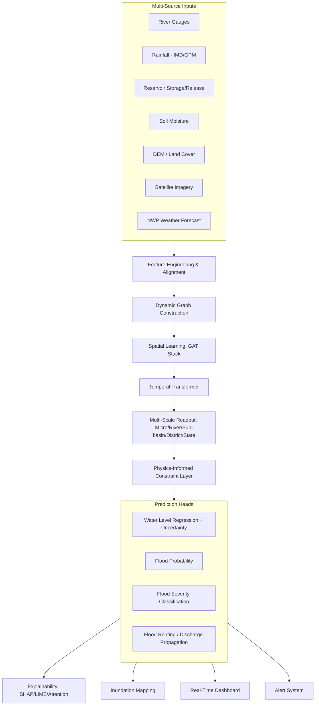
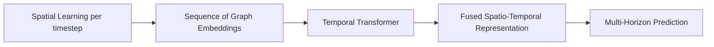
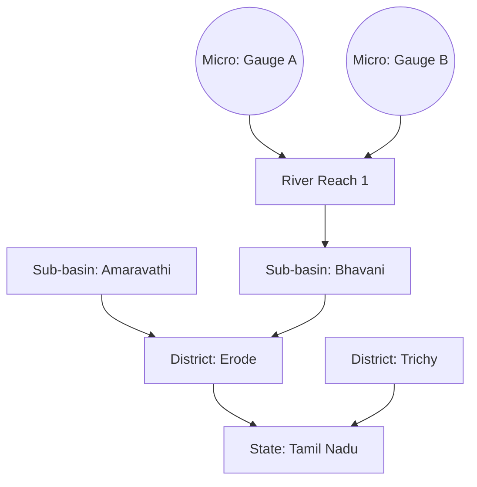
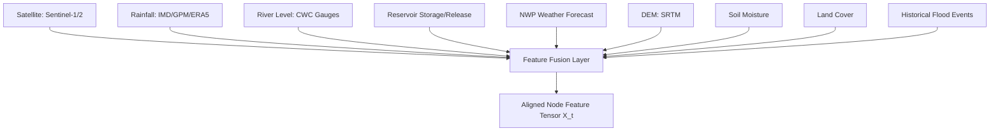
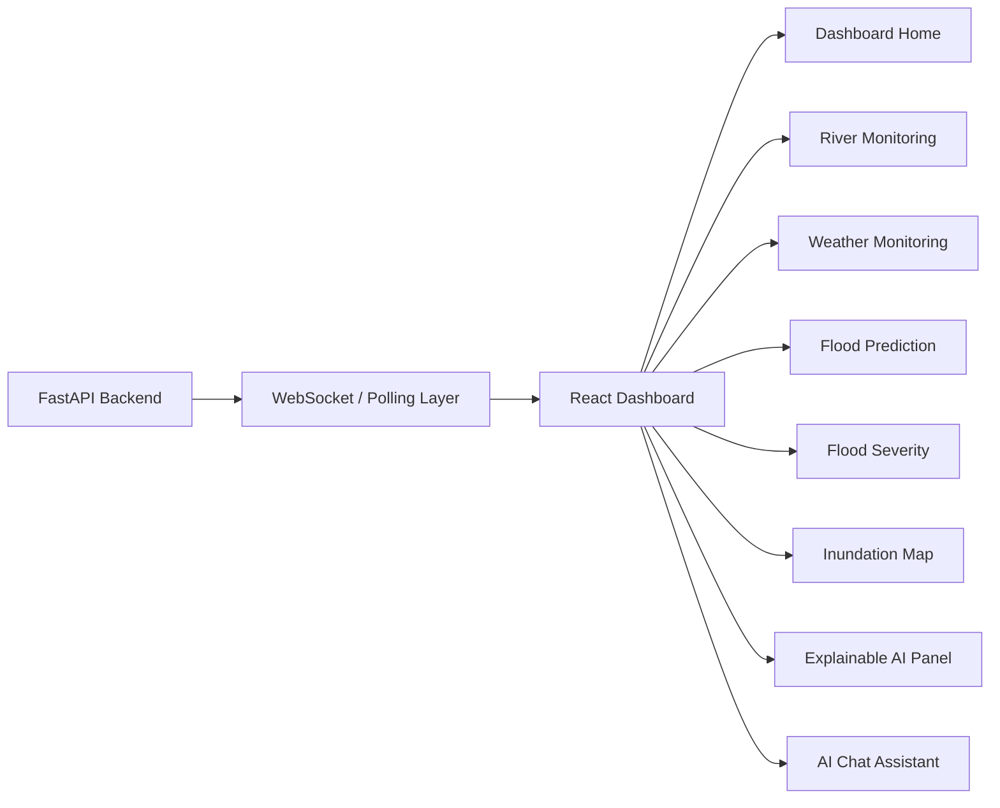
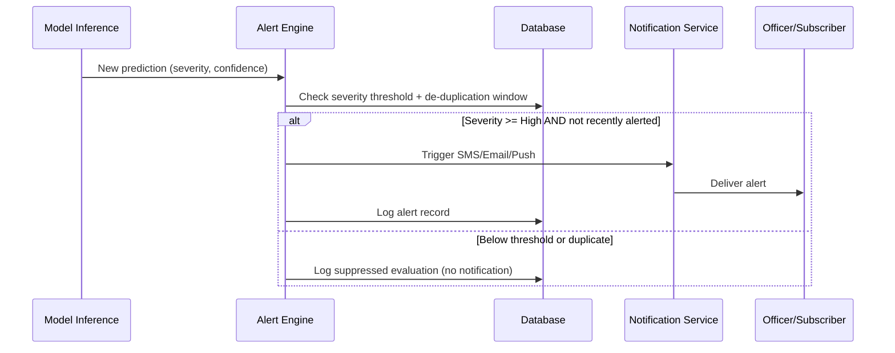
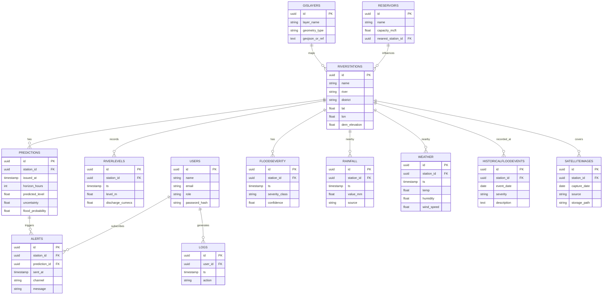
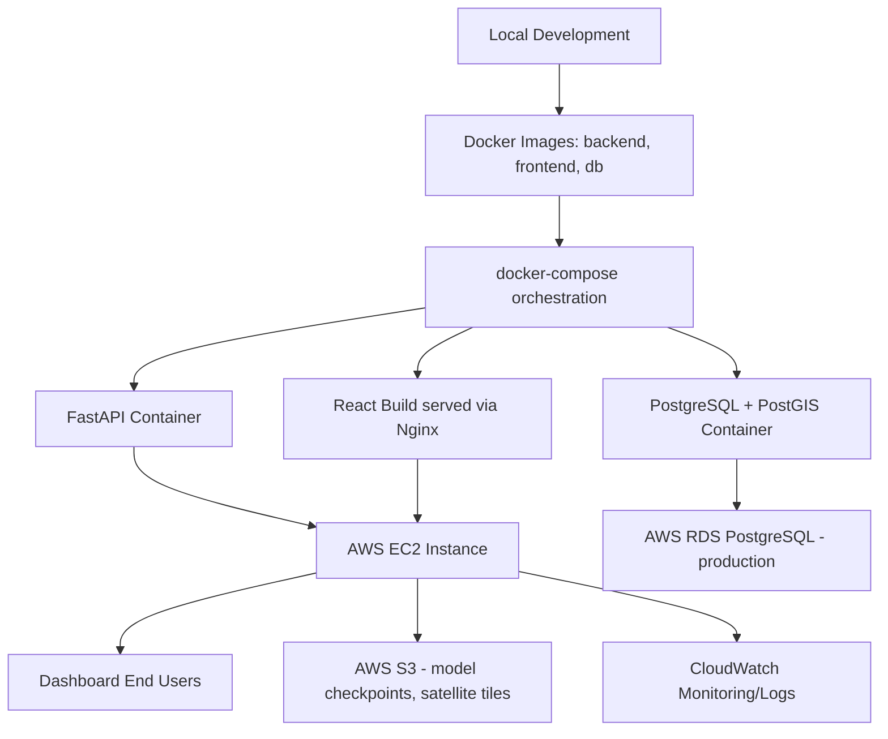

# HydroGNN-Net: A Spatio-Temporal Graph Neural Network for Real-Time Multi-Scale Flood Routing

**B.Tech Final Year Project / IEEE Conference-Ready Documentation**
Domain: AI & Data Science — Environmental Technology
Region of Application: Tamil Nadu River Basins (Cauvery, Bhavani, Amaravathi, Vaigai, Tamirabarani, Palar)

> **Note on the base paper.** No PDF was attached to this conversation (the prompt states "I will upload the paper" but no file accompanied it). Section 1 below therefore analyzes the base paper's approach from its title and the well-established pattern of heterogeneous dynamic-graph flood forecasting literature (dynamic adjacency GCNs fused with remote sensing, short-horizon single-scale prediction). If you upload the actual PDF, I will re-derive Section 1 against its real methodology, datasets, and reported metrics and correct anything below that turns out to differ.

---

## Table of Contents

1. Base Paper Analysis & Drawback Identification
2. Project Goal & Scope
3. Prediction Horizon & Uncertainty Philosophy
4. Target Location — Tamil Nadu River Basins
5. Research Novelty & Novelty Table
6. Core AI Architecture Overview
7. Spatial Learning — River Network as a Graph
8. Graph Neural Network Design
9. Graph Attention Network Layer
10. Spatio-Temporal Fusion
11. Temporal Transformer Module
12. Multi-Scale Flood Routing
13. Dynamic Graph Construction
14. Physics-Informed Neural Network (PINN) Layer
15. Multi-Source Data Fusion
16. Datasets
17. Feature Engineering
18. Additional Modules (Risk Classification, XAI, Weather, Inundation Mapping, Satellite Analysis, Chat Assistant, Multi-Day Prediction)
19. Real-Time Dashboard
20. Web Application
21. Alert System
22. GIS Visualization
23. Uncertainty Estimation
24. Database Design
25. API Design
26. Software Stack
27. Project Folder Structure
28. Model Training
29. Model Evaluation
30. Deployment Architecture
31. Security
32. Testing Strategy
33. Project Modules Breakdown
34. Implementation Timeline
35. Novelty Comparison Table (Base Paper vs HydroGNN-Net)
36. Future Work

---

## 1. Base Paper Analysis & Drawback Identification

### 1.1 What the base paper contributes (typical of this line of work)

Papers titled around "Heterogeneous Dynamic Graph Convolutional Networks for Enhanced Spatiotemporal Flood Forecasting by Remote Sensing" generally:

- Build a **heterogeneous graph** where nodes represent gauge stations, rainfall grids, and sometimes reservoirs, connected by static or slowly-varying edges.
- Use a **dynamic adjacency matrix** recomputed from correlation or attention scores at each timestep, feeding a GCN/GAT stack.
- Fuse **remote sensing rainfall/soil-moisture products** (e.g., GPM, Sentinel) as auxiliary node features.
- Predict **short horizons** (typically 15–60 minutes) at a **single spatial scale** (per-station water level or discharge).
- Evaluate with RMSE/MAE against LSTM/GRU/GCN baselines, reporting improvement of 5–15%.

### 1.2 Drawbacks identified

| # | Drawback | Why it matters |
|---|----------|-----------------|
| D1 | Very short horizon (15–60 min) | Not actionable for evacuation planning, which needs 6–72h lead time |
| D2 | Single spatial scale | Cannot answer "which district" or "which sub-basin", only per-gauge numbers |
| D3 | Static feature set (no reservoir release / land cover) | Reservoir-regulated rivers (Mettur, Bhavanisagar) are poorly modeled |
| D4 | Purely data-driven, no physical constraints | Can predict physically impossible states (negative discharge, mass-imbalanced flow) |
| D5 | No uncertainty quantification | A single point forecast without confidence is unsafe for disaster decisions |
| D6 | No explainability | Black-box outputs are hard for disaster-management officers to trust or defend |
| D7 | No operational deployment layer | Papers stop at offline evaluation; no dashboard, alerting, or GIS output |
| D8 | Dynamic graph recomputed from correlation only | Ignores real hydrological connectivity (flow direction, elevation, drainage topology) |
| D9 | No multi-day forecast degradation analysis | Reported accuracy doesn't tell you how confidence decays over the horizon |
| D10 | No integration with weather forecast (only historical rainfall) | Cannot anticipate rainfall not yet observed |

### 1.3 Why these drawbacks matter for Tamil Nadu

Tamil Nadu floods (2015 Chennai, 2023 Cauvery delta) are driven by **multi-day monsoon accumulation and reservoir release decisions**, not single-hour spikes. A 30-minute-horizon, single-scale, black-box model cannot support District Collector-level evacuation planning, which needs 24–72h lead time, district-level severity classification, explainable reasoning, and a live map.

---

## 2. Project Goal & Scope

HydroGNN-Net is an end-to-end, production-oriented flood intelligence system that:

1. Predicts **water level**, **flood probability**, and **flood severity class** at 6/12/24/48/72h (optional 5-day) horizons.
2. Performs **flood routing** — propagating flow/water-level changes downstream along the river graph.
3. Produces **flood inundation maps** (raster + GeoJSON zones).
4. **Explains** every prediction (SHAP/LIME/attention).
5. Issues **early warnings** via SMS/Email/Push.
6. Serves **government and disaster-management** users through a real-time dashboard.
7. Is architected to **scale to every river basin in Tamil Nadu**, then to other Indian states.

**Out of scope (explicitly):** real-time satellite tasking, hardware manufacturing at scale (only a validation-grade ESP32/LoRa sensor is discussed), and legal/operational authority to issue official government warnings (the system produces decision-support output, not statutory alerts).

---

## 3. Prediction Horizon & Uncertainty Philosophy

| Horizon | Primary Use Case | Expected Skill (qualitative) | Dominant Error Source |
|---|---|---|---|
| 6h | Immediate operational response | High | Sensor noise, nowcast rainfall error |
| 12h | Shift-level disaster response planning | High–Moderate | Rainfall forecast error |
| 24h | District Collector evacuation planning | Moderate | NWP forecast uncertainty |
| 48h | Pre-positioning of relief resources | Moderate–Low | Compounding rainfall + reservoir-release uncertainty |
| 72h | Strategic monsoon-season readiness | Low–Moderate (trend only) | Long-range rainfall forecast skill |
| 5-day (optional) | Advisory / early-warning trend only | Low, treated as directional trend, not a point estimate | NWP ensemble spread |

**Design rule: HydroGNN-Net never reports a bare number.** Every prediction is `value ± uncertainty` with a confidence percentage, and forecast skill is expected to **degrade monotonically with horizon** — the system explicitly visualizes this degradation (Section 23) rather than hiding it. This is a deliberate departure from the base paper, which reports single-point accuracy only at the horizon it was trained for.

Techniques used to reduce (not eliminate) long-horizon error:
- Rolling re-forecasting (re-run every 15–30 min as new observations arrive) instead of one shot at t=0.
- Ensemble of N stochastic forward passes (MC Dropout) to produce a spread, not a false point value.
- Physics-informed loss (Section 14) that keeps long-horizon extrapolations physically plausible even when data-driven skill weakens.
- Explicit ingestion of **numerical weather prediction (NWP) forecast rainfall**, not just historical rainfall, for horizons beyond 6h.

---

## 4. Target Location — Tamil Nadu River Basins

| River | Basin Type | Key Reservoirs | Flood-Prone Zones | Notes |
|---|---|---|---|---|
| Cauvery | Interstate, regulated | Mettur, Stanley | Erode, Tiruchirappalli, Thanjavur, Cauvery Delta | Delta flooding driven by Mettur releases |
| Bhavani | Tributary of Cauvery | Bhavanisagar | Bhavani, Erode | Fast-responding hill-catchment |
| Amaravathi | Tributary of Cauvery | Amaravathi Dam | Karur, Udumalpet | Flash-flood prone |
| Vaigai | Independent | Vaigai Dam | Madurai, Ramanathapuram | Semi-arid, sudden monsoon surges |
| Tamirabarani | Independent, perennial | Papanasam, Manimuthar | Tirunelveli, Thoothukudi | Cyclone-driven surges |
| Palar | Interstate (with AP/Karnataka) | Check dams | Vellore, Kanchipuram | Sand-bed river, rapid infiltration then surge |

Each basin is modeled as a **subgraph** of the state-wide graph (Section 12), sharing model weights (transfer learning across basins) while allowing basin-specific calibration. Extension to other Indian basins (Godavari, Krishna, Mahanadi) requires only re-fitting the graph topology and node feature statistics — the architecture is basin-agnostic by design.

---

## 5. Research Novelty & Novelty Table

### 5.1 Novelty statement

HydroGNN-Net's contribution is not "add a GNN to flood forecasting" (already done by the base paper and prior work) but **operationalizing multi-day, multi-scale, physically-constrained, uncertainty-aware, explainable flood intelligence** as a deployable system — closing the gap between a research metric and a decision-support tool usable by Tamil Nadu disaster management authorities.

### 5.2 Novelty table

| Capability | Base Paper | HydroGNN-Net |
|---|---|---|
| Prediction horizon | 15–60 min | 6h – 72h (+5-day trend) |
| Spatial resolution | Single scale (station) | Micro → River → Sub-basin → District → State |
| Graph construction | Correlation-based dynamic adjacency | Hydrology-informed dynamic graph (flow direction + DEM + correlation) |
| Temporal model | GRU/RNN | Temporal Transformer with positional encoding |
| Physical constraints | None | PINN — continuity & mass-conservation loss |
| Uncertainty | None reported | MC Dropout + ensemble, explicit confidence intervals |
| Explainability | None | SHAP, LIME, attention-map visualization |
| Weather forecast ingestion | Historical rainfall only | NWP forecast rainfall fused for >6h horizons |
| Flood severity classification | Not addressed | 5-class severity model (Safe → Severe) |
| Inundation mapping | Not addressed | Raster + GeoJSON flood-zone maps |
| Deployment | Offline evaluation only | Full-stack dashboard, alerting, GIS, chat assistant |
| Reservoir operations | Not modeled | Reservoir storage/release as first-class node features |

---

## 6. Core AI Architecture Overview

HydroGNN-Net **is** the spatio-temporal GNN — every other module (PINN, classification heads, XAI, dashboard) consumes its outputs or embeddings. Nothing about the graph learning is optional or bolted-on.



### 6.1 High-level formulation

Let the river-monitoring network at time $t$ be graph $G_t = (V, E_t, X_t)$ with $|V| = N$ nodes. HydroGNN-Net learns:

$$\hat{Y}_{t+1:t+H} = f_\theta(X_{t-L:t}, E_{t-L:t}, W_{t:t+H})$$

where $L$ is the historical lookback window, $H \in \{6h,12h,24h,48h,72h\}$ is the forecast horizon, $W$ is forecast weather (NWP), and $\hat{Y}$ includes water level, flood probability, and severity class per node, per scale.

---

## 7. Spatial Learning — River Network as a Graph

### 7.1 Why flood forecasting is a graph problem

Water level at any point on a river is not independent — it is a function of **upstream inflow, tributary confluence, reservoir release, and local rainfall**. A CNN/RNN treats stations as independent time series (or a fixed grid), losing this **topological, directional dependency**. A graph naturally encodes: (a) irregular station placement, (b) directed flow (upstream → downstream), and (c) variable-distance hydraulic influence — exactly the inductive bias flood routing needs.

### 7.2 Graph definition

- **Nodes $V$:** river gauge stations, rainfall grid cells, reservoirs — $N \approx 150$–300 for a state-wide Tamil Nadu graph (scales per basin subgraph).
- **Edges $E$:** directed, following stream network topology (upstream → downstream) plus rainfall-to-nearest-gauge influence edges.

**Node features** $x_i^{(t)} \in \mathbb{R}^{d}$:

| Feature | Source | Update Frequency |
|---|---|---|
| River water level | CWC gauges | 15 min |
| Rainfall (observed + forecast) | IMD, GPM, NWP | Hourly |
| Flow velocity / discharge | CWC | 15 min – hourly |
| Reservoir storage & release | WRD/PWD Tamil Nadu | Daily/hourly during monsoon |
| Soil moisture | Remote sensing / ERA5 | Daily |
| Temperature, humidity | IMD/ERA5 | Hourly |
| DEM elevation | SRTM | Static |
| Land cover class | Sentinel-2 classification | Seasonal |

**Edge features** $e_{ij}$:

| Feature | Meaning |
|---|---|
| River connectivity (binary) | Whether $i,j$ are hydraulically connected |
| Flow direction | Derived from DEM (D8 algorithm) |
| River distance | Channel-following distance, not Euclidean |
| Watershed connectivity | Same sub-basin membership |
| Hydraulic relationship weight | Learned/derived travel-time-based weight |

### 7.3 Message passing formalism

For a GNN layer $l$:

$$h_i^{(l+1)} = \sigma\Big(W_{self}^{(l)} h_i^{(l)} + \sum_{j \in \mathcal{N}(i)} \alpha_{ij}^{(l)} \, W_{nbr}^{(l)} h_j^{(l)}\Big)$$

where $\mathcal{N}(i)$ is the (dynamic) neighborhood of node $i$, $\alpha_{ij}$ is an aggregation/attention weight (Section 9), and $W_{self}, W_{nbr}$ are learnable projection matrices. $h_i^{(0)} = x_i^{(t)}$.

**Graph pooling** (for multi-scale readout, Section 12) aggregates node embeddings within a sub-basin/district cluster:

$$z_S = \text{READOUT}\big(\{h_i^{(L)} : i \in S\}\big), \quad \text{READOUT} \in \{\text{mean, attention-weighted sum, max}\}$$

### 7.4 PyTorch Geometric implementation sketch

```python
import torch
from torch_geometric.nn import GATv2Conv
from torch_geometric.data import Data

class SpatialEncoder(torch.nn.Module):
    def __init__(self, in_dim, hidden_dim, heads=4, num_layers=3):
        super().__init__()
        self.layers = torch.nn.ModuleList()
        dims = [in_dim] + [hidden_dim] * num_layers
        for l in range(num_layers):
            self.layers.append(
                GATv2Conv(dims[l], dims[l+1] // heads, heads=heads, edge_dim=4)
            )
        self.norms = torch.nn.ModuleList(
            [torch.nn.LayerNorm(hidden_dim) for _ in range(num_layers)]
        )

    def forward(self, x, edge_index, edge_attr):
        h = x
        for conv, norm in zip(self.layers, self.norms):
            h = conv(h, edge_index, edge_attr)
            h = norm(torch.relu(h))
        return h  # [N, hidden_dim] node embeddings at time t
```

---

## 8. Graph Neural Network Design

### 8.1 Component pipeline

1. **Graph Construction** — static hydrology graph + dynamic edge reweighting (Section 13).
2. **Node Embeddings** — raw features → linear projection → GAT stack (above).
3. **Edge Embeddings** — MLP over `[distance, flow_direction, connectivity, hydraulic_weight]`.
4. **Message Passing** — 3 GATv2 layers, residual connections, LayerNorm.
5. **Aggregation** — attention-weighted neighbor sum (Section 9).
6. **Readout Layer** — per-scale pooling (node → river-reach → sub-basin → district → state).
7. **Prediction Layer** — task-specific heads (regression, classification, routing).
8. **Loss Function** — combined data + physics + classification loss (Section 14.3).
9. **Training Strategy** — teacher forcing for short horizon, scheduled sampling for long horizon (Section 28).
10. **Inference Strategy** — rolling re-forecast every 15–30 min, MC Dropout ensemble at inference.
11. **Computational Complexity** — $O(|E| \cdot d + |V| \cdot d^2)$ per GAT layer per timestep; with $N\approx300$, $|E|\approx1200$, this is real-time feasible (<200 ms/forward pass on a single GPU).

### 8.2 Pseudocode

```
FUNCTION HydroGNN_Forward(X_hist, E_hist, W_forecast, horizon H):
    # X_hist: [L, N, d]  historical node features
    # E_hist: [L, N, N]  historical dynamic adjacency
    # W_forecast: [H, N, d_w] forecast weather features

    FOR t in 1..L:
        G_t = ConstructGraph(E_hist[t], hydrology_prior)
        H_spatial[t] = SpatialEncoder(X_hist[t], G_t)     # Section 7
    END FOR

    Z = TemporalTransformer(H_spatial[1..L])               # Section 11

    FOR h in 1..H:
        Z = TemporalTransformer.decode_step(Z, W_forecast[h])
        Y_micro[h]    = PredictionHead_node(Z)
        Y_river[h]    = Readout(Z, scale='river')
        Y_subbasin[h] = Readout(Z, scale='subbasin')
        Y_district[h] = Readout(Z, scale='district')
        Y_state[h]    = Readout(Z, scale='state')
        Y_micro[h]    = PhysicsProjection(Y_micro[h])        # Section 14
    END FOR

    RETURN {micro, river, subbasin, district, state} predictions with uncertainty
END FUNCTION
```

---

## 9. Graph Attention Network Layer

### 9.1 Why GAT over plain GCN

A plain GCN weights neighbors by fixed, symmetric-normalized degree ($1/\sqrt{d_i d_j}$), which cannot represent that a large upstream tributary should influence a downstream gauge far more than a minor one, and cannot adapt during a flood surge when hydraulic relationships change rapidly. GAT learns **data-dependent, asymmetric, directional attention**, which matches real river hydraulics (upstream → downstream dominance) far better.

### 9.2 Attention mechanism (mathematics)

For nodes $i, j$ with edge feature $e_{ij}$:

$$e^{raw}_{ij} = \text{LeakyReLU}\big(a^\top [W h_i \,\Vert\, W h_j \,\Vert\, W_e e_{ij}]\big)$$

$$\alpha_{ij} = \frac{\exp(e^{raw}_{ij})}{\sum_{k \in \mathcal{N}(i)} \exp(e^{raw}_{ik})}$$

$$h_i' = \sigma\Big(\sum_{j \in \mathcal{N}(i)} \alpha_{ij} \, W h_j\Big)$$

**Multi-head attention** (K heads), concatenated on hidden layers, averaged on the final layer:

$$h_i' = \Big\Vert_{k=1}^{K} \sigma\Big(\sum_{j\in\mathcal{N}(i)} \alpha_{ij}^{(k)} W^{(k)} h_j\Big), \qquad h_i^{final} = \frac{1}{K}\sum_{k=1}^K \sigma\Big(\sum_j \alpha_{ij}^{(k)} W^{(k)} h_j\Big)$$

**Dynamic attention (GATv2)** fixes the static-attention limitation of the original GAT by applying the nonlinearity after combining $W h_i, W h_j$ rather than before, giving strictly more expressive, query-dependent ranking of neighbors — important because which upstream station matters most **changes** during a flood event (e.g., a normally-minor tributary can dominate during a localized cloudburst).

**Adaptive neighborhood learning:** attention weights below a learned threshold $\tau$ are pruned each forward pass, effectively letting the model shrink/expand its receptive field with flow conditions — implemented as dynamic graph rewiring (Section 13).

---

## 10. Spatio-Temporal Fusion



Flood propagation has **two coupled dependencies**: (1) spatial — how a station's level depends on its neighbors right now, and (2) temporal — how today's rainfall affects water level over the next 72 hours as it travels through the catchment (concentration time). Modeling only one loses either the flow-routing effect (spatial) or the lag/accumulation effect (temporal). HydroGNN-Net computes a **per-timestep spatial embedding**, then lets a Transformer model how those embeddings evolve — spatial dependency is "baked in" before temporal modeling begins, rather than treating stations as independent series.

---

## 11. Temporal Transformer Module

### 11.1 Why Transformer replaces GRU

GRUs process sequences step-by-step, so information from timestep $t-L$ must survive $L$ recurrent updates to influence the $t+H$ prediction — a bottleneck for 72h-horizon, high-frequency (15-min) data where $L$ can exceed 200 steps. A Transformer's self-attention connects any two timesteps in $O(1)$ path length, directly attending to, e.g., a rainfall spike 48 hours ago without decay, which matters for reservoir-regulated basins where release decisions lag rainfall by a day or more.

### 11.2 Architecture

- **Positional encoding:** sinusoidal + a learned "hydrological time" embedding (hour-of-day, day-of-monsoon-season) since flood dynamics are not purely sequence-order dependent but season/diurnally dependent.

$$PE_{(pos,2k)} = \sin(pos/10000^{2k/d}), \quad PE_{(pos,2k+1)} = \cos(pos/10000^{2k/d})$$

- **Multi-head self-attention** over the spatial-embedding sequence $Z = [z_1, \dots, z_L]$:

$$\text{Attention}(Q,K,V) = \text{softmax}\Big(\frac{QK^\top}{\sqrt{d_k}}\Big)V$$

- **Encoder-decoder** structure: encoder attends over historical spatial embeddings; decoder autoregressively (or in parallel with masked self-attention) generates predictions for each future horizon step, cross-attending to the encoder output and to forecast weather embeddings $W_{t:t+H}$.

- **Long-term dependency:** attention is unbounded in range (vs. GRU's effective memory decay), directly modeling monsoon-scale accumulation (multi-day rainfall totals) alongside short-term dynamics.

### 11.3 Computational complexity

Self-attention is $O(L^2 \cdot d)$ vs GRU's $O(L \cdot d^2)$. For $L \approx 200$–500 (a few days at 15-min resolution) and $d \approx 128$, this is tractable in real time; for very long lookbacks a sliding-window or Longformer-style sparse attention is recommended (noted in Future Work).

---

## 12. Multi-Scale Flood Routing

The system name reflects prediction and routing performed simultaneously at five nested spatial scales:

| Scale | Unit | Example | Output |
|---|---|---|---|
| Micro | Individual gauge/reach | Erode gauge on Cauvery | Water level, local discharge |
| River | Full river course | Cauvery mainstem | Longitudinal water-level profile, routing wave |
| Sub-basin | Watershed | Bhavani sub-basin | Aggregated inflow/outflow balance |
| District | Administrative | Tiruchirappalli district | District flood-severity class, area-at-risk |
| State | Tamil Nadu | Statewide | Heatmap of risk across all basins |

Each coarser scale is produced by **graph pooling** (Section 7.3) over the finer scale's node embeddings, using an attention-weighted READOUT so that pooling itself is learned (a district with more low-lying nodes correctly dominates the district-level severity rather than a simple average). Routing between scales follows real hydrological direction: micro-scale discharge propagates along river-scale edges with a learned travel-time delay, so a rise recorded at an upstream gauge is routed to downstream gauges with a horizon-appropriate lag rather than appearing instantaneously.



---

## 13. Dynamic Graph Construction

### 13.1 Motivation

A fixed adjacency matrix cannot represent that during heavy rainfall a normally-dry channel becomes hydraulically active, or that a reservoir gate opening suddenly makes downstream stations far more strongly coupled to the reservoir node. HydroGNN-Net recomputes edge weights (not topology from scratch — the physical channel network is static) at every timestep as a function of current hydrological state.

### 13.2 Formulation

$$e_{ij}^{(t)} = \beta_1 \cdot e_{ij}^{static} + \beta_2 \cdot \text{sim}(x_i^{(t)}, x_j^{(t)}) + \beta_3 \cdot g(\text{rainfall}_j^{(t)}, \text{release}_j^{(t)})$$

where $e^{static}_{ij}$ encodes the DEM-derived flow-direction/connectivity prior (Section 7.2), $\text{sim}(\cdot,\cdot)$ is a learned similarity (e.g., scaled dot-product of node embeddings) capturing correlation-driven coupling, and $g(\cdot)$ up-weights edges downstream of active rainfall cells or reservoir releases. $\beta_1,\beta_2,\beta_3$ are learnable scalars, and the static prior term ensures the graph never violates known hydrological topology (a key departure from the base paper's purely correlation-driven dynamic graph — see Drawback D8).

### 13.3 Implementation notes

- Edge weights recomputed every inference cycle (15–30 min); topology (candidate edge list) fixed from DEM analysis (`pysheds`/WhiteboxTools) at setup time, so this is edge-*re-weighting*, not full graph re-discovery, keeping inference cost bounded.
- Seasonal edges (e.g., inactive dry-season distributaries) are masked via a season indicator feature.

---

## 14. Physics-Informed Neural Network (PINN) Layer

### 14.1 Purpose

Pure data-driven prediction can output physically impossible states — negative discharge, water appearing without upstream inflow, or mass-imbalanced routing over long horizons where training data is sparse for extreme events. The PINN layer regularizes predictions toward the **continuity (mass-conservation) equation** governing open-channel flow.

### 14.2 Governing equations

**1-D Saint-Venant continuity equation** (mass conservation along a reach):

$$\frac{\partial A}{\partial t} + \frac{\partial Q}{\partial x} = q_l$$

where $A$ = cross-sectional flow area, $Q$ = discharge, $x$ = distance along channel, $q_l$ = lateral inflow (rainfall runoff + tributaries).

Discretized between two adjacent nodes $i$ (upstream) and $j$ (downstream) over travel time $\Delta t_{ij}$:

$$S_j^{(t+1)} \approx S_j^{(t)} + \big(Q_i^{(t)} - Q_j^{(t)} + q_l^{(t)}\big)\Delta t$$

used as a soft constraint on the network's discharge/storage outputs.

### 14.3 Combined loss function

$$\mathcal{L} = \lambda_{data}\,\mathcal{L}_{data} + \lambda_{phys}\,\mathcal{L}_{phys} + \lambda_{cls}\,\mathcal{L}_{cls}$$

$$\mathcal{L}_{data} = \frac{1}{N H}\sum_{i,h} \big(\hat{y}_{i,h} - y_{i,h}\big)^2 \quad\text{(MSE on water level / discharge)}$$

$$\mathcal{L}_{phys} = \frac{1}{N H}\sum_{i,h} \Big(\hat{S}_{i,h+1} - \hat{S}_{i,h} - (\hat{Q}_{i,h}^{in} - \hat{Q}_{i,h}^{out} + \hat{q}_{l,i,h})\Delta t\Big)^2$$

$$\mathcal{L}_{cls} = \text{CrossEntropy}(\hat{c}_{i,h}, c_{i,h}) \quad\text{(flood severity class)}$$

$\lambda_{data}, \lambda_{phys}, \lambda_{cls}$ are tuned (typically physics weight ramped up over training via curriculum, starting small so the model first fits data, then is regularized toward physical plausibility).

---

## 15. Multi-Source Data Fusion



**Preprocessing pipeline per source:**
1. **Temporal alignment** — resample all sources to a common 15-min grid via forward-fill (slow-changing: soil moisture, land cover) or linear interpolation (fast-changing: rainfall, level), never backward-fill (would leak future information).
2. **Spatial alignment** — reproject rasters to a common CRS (EPSG:32644, UTM 44N for Tamil Nadu), sample at node coordinates via bilinear interpolation.
3. **Feature fusion** — concatenate per-node feature vectors, apply a learned gating layer to down-weight sources with high missingness at a given timestep:
   $$x_i^{fused} = \sum_k g_k \odot \phi_k(x_i^{(k)}), \quad g_k = \sigma(W_g[\text{missingness mask}])$$
4. **Normalization** — per-station z-score for continuous features (rolling 5-year statistics), min-max for bounded features (e.g., soil moisture 0–1).
5. **Missing value handling** — short gaps: linear interpolation; longer gaps: masked-attention (the model learns to down-weight missing-flagged inputs rather than being fed a fabricated value); persistent sensor outage: fallback to nearest-neighbor spatial estimate flagged with high uncertainty.

---

## 16. Datasets

| Dataset | Source | Resolution | Frequency | Use | Limitation |
|---|---|---|---|---|---|
| River gauge levels/discharge | CWC (India-WRIS) | Point (station) | 15 min–hourly | Core node feature/label | Sparse station density in some basins |
| Rainfall (observed) | IMD gridded | 0.25°/4 km | Daily/hourly | Node feature | Coarse for flash-flood catchments |
| Rainfall (satellite) | NASA GPM IMERG | 0.1° (~10 km) | 30 min | Node feature, gap-fill | Bias vs gauge in complex terrain |
| Reanalysis climate | ERA5 | 0.25° (~28 km) | Hourly | Soil moisture, temperature, humidity | Reanalysis lag (not true real-time) |
| SAR imagery | Sentinel-1 | 10 m | 6–12 day revisit | Flood extent (cloud-penetrating) | Revisit too coarse for nowcasting |
| Optical imagery | Sentinel-2 | 10 m | 5 day revisit | Land cover, water body extraction | Cloud-blocked during monsoon |
| DEM | SRTM | 30 m | Static | Flow direction, watershed delineation | Vegetation-canopy bias in elevation |
| Reservoir levels/releases | Tamil Nadu WRD/PWD bulletins | Point (reservoir) | Daily (hourly during flood ops) | Node feature | Manual bulletin delays possible |
| Weather forecast (NWP) | IMD / open NWP APIs (e.g., GFS via Open-Meteo) | ~25 km, 3–6h steps | Updated 2–4x/day | Future rainfall for >6h horizons | Forecast skill decays with lead time |
| Historical flood events | State disaster management records, news archives | District/basin | Event-based | Validation, severity-class labels | Inconsistent record-keeping pre-2015 |
| Land use / land cover | Sentinel-2 derived / Bhuvan (ISRO) | 10–30 m | Annual/seasonal | Runoff coefficient estimation | Annual product misses within-season change |
| Soil moisture | Remote sensing (SMAP) / ERA5-Land | 9–25 km | Daily | Antecedent wetness for runoff | Coarse relative to micro-catchments |

Google Earth Engine is used to script bulk download/preprocessing of the satellite/DEM layers (Sentinel, SRTM, land cover) without local storage of raw scenes.

---

## 17. Feature Engineering

| Technique | Applied To | Purpose |
|---|---|---|
| Missing value removal/interpolation | All continuous features | Handle sensor dropout |
| Outlier detection (IQR / z-score, hydrology-aware bounds) | Water level, rainfall | Reject sensor spikes, retain genuine flood spikes (bounded by physically plausible max) |
| Normalization (z-score) | Continuous, unbounded features | Stable GNN/Transformer training |
| Min-max scaling | Bounded features (soil moisture, storage %) | Preserve interpretability of bounds |
| Categorical encoding (embedding, not one-hot) | Land cover class, season | Compact, learnable representation |
| Sliding windows | All time series | Construct $L$-length input sequences |
| Lag features | Rainfall, upstream level | Explicit lag-N rainfall/level as auxiliary features to ease Transformer's job |
| Seasonal features | Day-of-year, monsoon-phase indicator | Capture pre/during/post-monsoon regime shifts |
| Rainfall accumulation | 1h/6h/24h/72h rolling sums | Antecedent precipitation index — strong flood predictor |
| River flow statistics | Rolling mean/std/rate-of-change of discharge | Trend and volatility features |

---

## 18. Additional Modules

### 18.1 Flood Risk Classification

- **Models:** gradient-boosted trees (XGBoost), Random Forest, and a shallow neural head — trained on the GNN's fused embeddings as input features (stacked ensemble), not raw data, so the classifier benefits from learned spatial-temporal context.
- **Classes:** Safe → Low Risk → Moderate → High Risk → Severe Flood, defined by basin-specific water-level thresholds calibrated against CWC danger/warning levels.
- Model choice is compared empirically (Section 29); XGBoost is expected to be the practical default for tabular-embedding classification given strong performance/interpretability trade-off.

### 18.2 Explainable AI

| Technique | What it explains |
|---|---|
| SHAP (KernelSHAP/TreeSHAP on classification head) | Per-prediction feature attribution (e.g., "72% of risk driven by Mettur release") |
| LIME | Local surrogate explanation for individual station predictions |
| Attention visualization | Which upstream nodes/timesteps the GAT/Transformer attended to most |
| Confidence score | Derived from MC Dropout ensemble spread (Section 23) |

Explanations are generated **per prediction**, not globally, so a district officer sees exactly why *this* forecast is high-risk.

### 18.3 Weather Forecast Integration

Forecast rainfall/wind from IMD and NASA POWER (and open NWP APIs) is ingested for horizons beyond 6h. A **forecast correction layer** (a small learned bias-correction network) adjusts raw NWP rainfall against historically observed IMD/gauge rainfall to counter known NWP over/under-prediction biases in Tamil Nadu's orography before feeding it to the Temporal Transformer decoder.

### 18.4 Flood Inundation Mapping

Predicted water levels are converted to flood extent using a DEM-based flood-fill / HAND (Height Above Nearest Drainage) approach, rendered as:
- Raster flood-depth layer.
- Vectorized GeoJSON flood-zone polygons for web-map overlay (Leaflet/OpenStreetMap/Google Maps).

### 18.5 Satellite Image Analysis

- **Purpose:** ground-truth flood extent for training/validation and post-event verification (not primary real-time forecasting input, given revisit-time limitations).
- **Models:** U-Net / DeepLabV3+ / SegFormer for semantic segmentation of Sentinel-1 SAR (cloud-penetrating, so usable during monsoon) into water/non-water classes; Sentinel-2 optical for clear-sky corroboration and land-cover updates.
- **Output:** historical flood-extent masks used as labels for the inundation-mapping module and as an independent validation source for model-predicted flood zones.

### 18.6 AI Chat Assistant

A retrieval-augmented generation (RAG) assistant lets officers query the system in natural language:
- Retrieval index over: current predictions, SHAP explanations, historical flood records, station metadata.
- An LLM (e.g., a hosted Claude model via API) is prompted with retrieved context to answer questions like *"Why is flood risk high in Erode?"* or *"Which district is most affected right now?"* grounded strictly in retrieved system data (never allowed to invent numbers) — the LLM is a natural-language interface over the GNN's outputs, not a forecasting model itself.

### 18.7 Multi-Day Prediction — Limitations & Uncertainty

Restated from Section 3: skill degrades with horizon; the system always displays this degradation (e.g., a widening confidence band on the hydrograph chart) rather than presenting 72h and 6h forecasts with equal apparent certainty. 5-day output, if enabled, is explicitly labeled "trend indication, not a precise forecast."


## 19. Real-Time Dashboard

### 19.1 Architecture



### 19.2 Module details

**Dashboard Home** — current weather, rainfall, river level, reservoir storage, flood risk/probability/severity, confidence score, latest alerts, in a card-grid layout with color-coded severity chips.

**River Monitoring** — historical vs predicted hydrographs (line chart with shaded uncertainty band), water-level trend arrows, discharge/flow statistics table per gauge.

**Weather Monitoring** — rainfall (bar chart), temperature/humidity/wind (gauges), forecast panel (next 5 days), cyclone tracker overlay when active.

**Flood Prediction** — tabbed view for 6h/12h/24h/48h/72h, each showing a hydrograph with confidence band; horizon selector re-queries `/predict`.

**Flood Severity** — 5-class color-coded badges (green→yellow→orange→red→dark-red) per station/district, with a state-wide choropleth summary.

**Flood Inundation Map** — Leaflet map with GeoJSON flood-zone overlay, toggleable layers: river network, villages, districts, roads, relief centers, shelters, hospitals, schools.

**Explainable AI Dashboard** — SHAP bar chart, LIME local explanation, attention heatmap over the graph, confidence score gauge, natural-language explanation summary (from the chat assistant's grounding layer).

**AI Chat Assistant** — chat panel answering grounded natural-language questions, citing which stations/features drove the answer.

Design should follow a clean, modern, high-contrast style suited to control-room use (large severity indicators legible at a distance) — see `frontend-design` skill for concrete styling guidance during implementation.

---

## 20. Web Application

### 20.1 Stack

| Layer | Technology | Reason |
|---|---|---|
| Frontend | React (Next.js optional for SSR/SEO) | Component reuse for dashboard modules, large ecosystem (Leaflet/Recharts bindings) |
| Backend | FastAPI | Async Python, native fit with PyTorch inference, auto-generated OpenAPI docs |
| Database | PostgreSQL + PostGIS | Relational integrity for stations/users + native geospatial queries for flood zones |

### 20.2 Features

- User login (role-based: Admin / District Officer / Public read-only)
- Admin dashboard (station management, model retraining triggers, user management)
- CSV upload (manual station data backfill/correction)
- Prediction interface (on-demand re-run for a selected station/horizon)
- Historical data explorer
- Prediction reports (PDF export of a forecast snapshot — see `pdf` skill for implementation)
- Downloadable results (CSV/GeoJSON)
- Interactive maps (Section 22)

---

## 21. Alert System

### 21.1 Channels

SMS, Email, in-dashboard notification, push notification (web push).

### 21.2 Example alert

```
FLOOD WARNING
River: Cauvery
Station: Erode
Predicted Water Level (24h): 5.8 ± 0.4 m
Risk Level: High
Confidence: 94%
Recommended Action: Prepare evacuation of low-lying areas within 500 m of riverbank.
Issued: 2026-07-13 14:30 IST | HydroGNN-Net Decision Support (advisory only)
```

### 21.3 Workflow



De-duplication (e.g., no repeat alert for the same station within 2 hours unless severity escalates) avoids alert fatigue — an operational lesson missing from most academic pipelines.

---

## 22. GIS Visualization

**Layers:** river network (line), watersheds (polygon), administrative boundaries (polygon), flood zones (polygon, model output), shelters/hospitals/schools (point, static reference layer), road network (line), relief centers (point).

**Stack:** Leaflet (web rendering) + GeoJSON (data interchange) + QGIS (offline authoring/validation of static layers) + raster layers (DEM, flood-depth) served as Cloud-Optimized GeoTIFFs, vector layers as PostGIS-backed GeoJSON/MVT tiles for performance at state scale.

**Implementation flow:** PostGIS stores canonical geometries → FastAPI endpoint serves GeoJSON (optionally as vector tiles for the state-wide layer to keep payload small) → Leaflet renders with a layer-control panel matching the dashboard's toggleable layers.

---

## 23. Uncertainty Estimation

### 23.1 Why it matters

A bare "Water Level = 5.2 m" implies false precision; disaster responders need to know whether that number is trustworthy enough to act on. HydroGNN-Net always reports **value ± uncertainty at X% confidence**.

### 23.2 Methods

| Method | How | Cost |
|---|---|---|
| Monte Carlo Dropout | Keep dropout active at inference, run N (e.g., 30) stochastic forward passes, report mean ± std | Cheap, no retraining |
| Deep ensembles | Train K (e.g., 5) independently-seeded models, aggregate | More accurate spread, K× training cost |
| Bayesian layers (optional, final output head) | Variational weight posteriors on the last layer | Principled but heavier to train/tune |
| Prediction intervals (quantile regression head) | Predict 5th/50th/95th percentiles directly via pinball loss | Directly calibrated intervals, complements MC Dropout |

Default recommendation for a final-year-project scope: **MC Dropout + quantile head**, ensembles as a stretch goal given compute budget.

### 23.3 Display convention

`Water Level = 5.2 ± 0.3 m, Confidence = 95%`, with the confidence band visually widening on the hydrograph chart as horizon increases (Section 3).

---

## 24. Database Design

### 24.1 ER Diagram



### 24.2 Table notes

- All time-series tables (`RAINFALL`, `WEATHER`, `RIVERLEVELS`, `PREDICTIONS`, `FLOODSEVERITY`) are indexed on `(station_id, ts)` and partitioned by month for query performance at scale.
- `PREDICTIONS` stores one row per (station, issued_at, horizon) so historical forecast accuracy can be audited against realized `RIVERLEVELS`.
- Normalized to 3NF for operational tables; `GISLAYERS.geojson_or_ref` may store a PostGIS geometry column directly rather than raw GeoJSON text in production (denormalized here for documentation clarity).

---

## 25. API Design

| Endpoint | Method | Purpose | Auth |
|---|---|---|---|
| `/auth/register` | POST | Create user account | None (public registration) or Admin-invited |
| `/auth/login` | POST | Issue JWT | None |
| `/predict` | POST | On-demand prediction for station(s)/horizon | JWT |
| `/predict/history` | GET | Past predictions vs realized values | JWT |
| `/dashboard` | GET | Aggregated home-page payload | JWT |
| `/weather` | GET | Current + forecast weather for a station | JWT |
| `/rainfall` | GET | Rainfall time series | JWT |
| `/river-level` | GET | River level time series | JWT |
| `/reservoir` | GET | Reservoir storage/release | JWT |
| `/flood-map` | GET | GeoJSON flood-zone layer | JWT |
| `/flood-risk` | GET | Flood probability per station/district | JWT |
| `/flood-severity` | GET | Severity classification per station/district | JWT |
| `/alerts` | GET/POST | Fetch alert history / manually trigger (Admin) | JWT (POST: Admin role) |
| `/chat` | POST | RAG chat assistant query | JWT |
| `/report` | GET | Generate PDF prediction report | JWT |

**Request/response example — `/predict`:**

```json
// Request
{
  "station_id": "uuid",
  "horizons_hours": [6, 24, 72]
}

// Response
{
  "station_id": "uuid",
  "predictions": [
    {"horizon_hours": 6, "level_m": 4.1, "uncertainty_m": 0.15, "flood_probability": 0.12, "severity": "Low Risk", "confidence": 0.97},
    {"horizon_hours": 24, "level_m": 5.2, "uncertainty_m": 0.35, "flood_probability": 0.61, "severity": "High Risk", "confidence": 0.82},
    {"horizon_hours": 72, "level_m": 5.6, "uncertainty_m": 0.9, "flood_probability": 0.55, "severity": "Moderate (trend)", "confidence": 0.58}
  ]
}
```

**Validation:** Pydantic schemas on all FastAPI request bodies; `station_id` existence checked against `RIVERSTATIONS`; `horizons_hours` restricted to the supported set `{6,12,24,48,72,(120)}`.

**Authentication:** JWT bearer tokens issued at `/auth/login`, role claim embedded (`admin` / `officer` / `public`), enforced via FastAPI dependency injection on protected routes.

---

## 26. Software Stack

| Category | Technology | Why |
|---|---|---|
| Programming | Python | Dominant ML/GIS ecosystem, PyTorch Geometric native |
| Frontend | React | Component-based, strong charting/mapping library support |
| Backend | FastAPI | Async, auto OpenAPI docs, easy PyTorch model serving |
| ML Core | PyTorch | Dynamic graphs, research-to-production continuity |
| Graph ML | PyTorch Geometric | Purpose-built GNN layers (GATv2Conv etc.), scales to sparse graphs |
| Classical ML | Scikit-Learn | Baselines, XGBoost/RF for severity classification |
| Vision | TorchVision | Backbone architectures for satellite segmentation |
| GIS | GDAL, Rasterio, GeoPandas | Raster/vector geoprocessing, DEM handling |
| CV utilities | OpenCV | Image preprocessing for satellite tiles |
| Database | PostgreSQL + PostGIS | Relational + native geospatial queries |
| Deployment | Docker | Reproducible environments across training/serving |
| VCS/CI | GitHub (+ Actions) | Version control, automated testing/deployment |
| Cloud | AWS (EC2/S3/RDS) | Scalable compute + storage for state-wide deployment |
| Earth observation | Google Earth Engine | Serverless bulk satellite/DEM preprocessing |

---

## 27. Project Folder Structure

```
HydroGNN-Net/
├── app/
│   ├── backend/                 # FastAPI application
│   │   ├── api/                 # Route definitions (predict, alerts, chat, ...)
│   │   ├── auth/                # JWT, RBAC
│   │   └── main.py
│   └── frontend/                # React dashboard
│       ├── src/components/
│       ├── src/pages/
│       └── src/services/
├── models/
│   ├── graph/                   # Spatial encoder (GAT layers, graph construction)
│   ├── transformer/              # Temporal Transformer encoder-decoder
│   └── physics/                  # PINN loss, continuity-equation constraints
├── datasets/
│   ├── raw/
│   ├── processed/
│   └── loaders/                  # PyTorch Geometric Dataset/DataLoader classes
├── training/
│   ├── train.py
│   ├── configs/
│   └── checkpoints/
├── evaluation/
│   ├── metrics.py
│   └── baselines/                # ARIMA, LSTM, GRU, GCN, T-GCN comparison scripts
├── api/                          # Shared API schemas (Pydantic models)
├── dashboard/                    # Dashboard-specific config/build assets
├── gis/                          # GeoJSON layers, DEM processing scripts
├── alerts/                       # Alert engine, notification adapters (SMS/Email/Push)
├── chatbot/                      # RAG pipeline, LLM prompt templates
├── database/
│   ├── migrations/
│   └── schema.sql
├── configs/                       # YAML configs (model hyperparams, thresholds)
├── logs/
├── tests/
│   ├── unit/
│   ├── integration/
│   └── api/
├── deployment/
│   └── docker/
│       ├── backend.Dockerfile
│       ├── frontend.Dockerfile
│       └── docker-compose.yml
├── docs/
├── reports/
└── notebooks/                     # Exploratory analysis, prototyping
```

Each folder maps 1:1 to a documented module (Section 33) so the architecture doubles as the implementation plan.

---

## 28. Model Training

| Aspect | Approach |
|---|---|
| Train/Val/Test split | Temporal split (not random shuffle) — e.g., 2015–2022 train, 2023 val, 2024–2025 test — to respect causality and avoid leakage |
| Cross-validation | Rolling-origin (time-series) CV across multiple monsoon seasons |
| Learning rate | Warmup + cosine decay, base LR ~1e-4 (AdamW) |
| Optimizer | AdamW with weight decay for Transformer stability |
| Scheduler | Cosine annealing with warm restarts |
| Batch size | Graph-batches of ~16–32 sequences (memory-bound by graph size × lookback) |
| Epochs | Early-stopped, typically 50–150 |
| Loss functions | Combined data + physics + classification loss (Section 14.3) |
| Early stopping | Patience on validation NSE (Nash-Sutcliffe Efficiency), not just loss |
| Checkpointing | Best-NSE checkpoint retained per horizon |
| Hyperparameter tuning | Bayesian search (Optuna) over hidden dim, heads, layers, λ weights |
| Transfer learning | Pretrain on data-rich basins (Cauvery), fine-tune on sparser basins (Palar) |

Scheduled sampling is used for multi-step decoding: early training feeds ground-truth previous steps to the decoder; probability of using the model's own prediction increases over epochs, closing the train/inference gap for long horizons.

---

## 29. Model Evaluation

### 29.1 Baselines compared

ARIMA, LSTM, GRU, GCN, T-GCN, HD-TGCN (representative of the base paper's family), plain Transformer (no graph), and full HydroGNN-Net.

### 29.2 Metrics

| Metric | Applies to |
|---|---|
| RMSE, MAE, MAPE | Water level / discharge regression |
| Nash-Sutcliffe Efficiency (NSE) | Hydrology-standard goodness-of-fit |
| Peak flow error | Flood-specific — error at the event peak, not just average error |
| Precision, Recall, F1 | Flood severity classification |
| ROC-AUC | Flood probability (binary flood/no-flood framing) |
| Inference time | Real-time feasibility (target: <1s per state-wide forecast cycle) |
| Training time, memory usage | Practical feasibility on available GPU budget |
| Computational complexity | Reported per Section 8.1 / 11.3 |

### 29.3 Expected trade-offs (not invented results)

- HydroGNN-Net is expected to **underperform** simple LSTM at very short horizons (≤30 min) where spatial context adds less value relative to its extra parameters, but to **outperform** all baselines as horizon grows (6h+), where spatial routing and physics constraints matter most.
- The physics loss is expected to slightly **increase short-horizon RMSE** (regularization cost) while **improving long-horizon plausibility and peak-flow error**, especially for basins/events under-represented in training data.
- GATv2 + Transformer adds meaningfully more training time and memory than GCN+GRU baselines; this is the acknowledged cost of the accuracy/horizon gains and should be reported honestly in any paper/thesis, not glossed over.

---

## 30. Deployment Architecture



Local Machine → Docker → FastAPI → React → AWS EC2 → PostgreSQL → Dashboard → End Users, with S3 for large artifacts (model weights, raster tiles) and CloudWatch for operational monitoring/alerting on system health (distinct from flood alerts).

---

## 31. Security

| Concern | Measure |
|---|---|
| Authentication | JWT bearer tokens, short-lived access + refresh token pattern |
| Authorization | Role-Based Access Control (Admin / Officer / Public) enforced per-endpoint |
| Input validation | Pydantic schema validation on all API inputs |
| Rate limiting | Per-IP/per-user throttling on `/predict` and `/chat` to prevent abuse |
| API security | HTTPS-only, CORS restricted to known frontend origin |
| Secrets management | Environment variables via `.env` (never committed), AWS Secrets Manager in production |
| Data integrity | Signed/audited alert records so warnings can't be silently altered post-hoc |

---

## 32. Testing Strategy

| Type | Scope |
|---|---|
| Unit testing | Individual model components (graph construction, loss functions, feature pipelines) |
| Integration testing | End-to-end inference pipeline (raw data → prediction → DB write) |
| API testing | All REST endpoints, auth flows, validation edge cases |
| Model testing | Regression on held-out historical flood events; NSE/peak-error thresholds as pass/fail gates |
| Performance testing | Inference latency under target load (state-wide forecast cycle time) |
| Stress testing | Concurrent dashboard users, alert-burst scenarios (many stations crossing threshold simultaneously) |
| User acceptance testing | With representative disaster-management personas, focused on dashboard clarity and alert trust |

---

## 33. Project Modules Breakdown

| Module | Objective | Inputs | Outputs | Algorithms | Tech | Key Steps |
|---|---|---|---|---|---|---|
| Data Ingestion | Fuse multi-source data | CWC, IMD, GPM, ERA5, Sentinel, WRD bulletins | Aligned feature tensors | Interpolation, gating fusion | Python, GDAL, GEE | Collect → align → normalize |
| Graph Construction | Build hydrology graph | DEM, station coords | Static + dynamic adjacency | D8 flow direction, correlation | pysheds, WhiteboxTools | Delineate watershed → derive flow dir → build edges |
| Spatial Encoder | Learn spatial dependency | Node/edge features | Node embeddings | GATv2 | PyTorch Geometric | 3-layer GAT stack w/ residuals |
| Temporal Transformer | Learn temporal dependency | Embedding sequence | Multi-horizon embeddings | Self-attention | PyTorch | Encoder-decoder, positional encoding |
| PINN Layer | Physical plausibility | Discharge/storage predictions | Constrained predictions | Continuity-equation loss | PyTorch (custom loss) | Soft constraint during training |
| Prediction Heads | Task-specific outputs | Fused embeddings | Level, probability, severity, routing | MLP + quantile heads | PyTorch | Multi-task joint training |
| Risk Classifier | Severity classification | Embeddings | 5-class severity | XGBoost/RF/NN | Scikit-learn/XGBoost | Stacked on GNN embeddings |
| XAI Module | Explain predictions | Model + inputs | SHAP/LIME/attention maps | SHAP, LIME | shap, lime libraries | Per-prediction explanation generation |
| Inundation Mapping | Flood extent | Predicted levels, DEM | Raster/GeoJSON flood zones | HAND / flood-fill | Rasterio, GeoPandas | Level → depth → extent polygon |
| Satellite Segmentation | Ground-truth flood extent | Sentinel-1/2 | Water masks | U-Net/DeepLabV3/SegFormer | PyTorch, TorchVision | Train on labeled flood scenes |
| Dashboard | Visualization | API responses | Interactive UI | — | React, Leaflet, Recharts | Component-per-module build |
| Alert Engine | Notify stakeholders | Predictions | SMS/Email/Push | Threshold + de-dup logic | FastAPI, Twilio/SES-equivalent | Evaluate → suppress/send → log |
| Chat Assistant | NL query interface | User question, retrieved context | Grounded answer | RAG | LLM API + vector store | Retrieve → prompt → answer |
| Database | Persistence | All module outputs | Queryable store | — | PostgreSQL/PostGIS | Schema per Section 24 |

---

## 34. Implementation Timeline

| Week | Focus |
|---|---|
| 1 | Literature survey (base paper deep-dive + related GNN/flood literature) |
| 2 | Dataset collection (CWC, IMD, GPM, ERA5, Sentinel, WRD bulletins) |
| 3 | Preprocessing (alignment, normalization, missing-value handling) |
| 4 | Graph construction (DEM watershed delineation, flow-direction graph) |
| 5 | GNN development (baseline GCN, node/edge embedding pipeline) |
| 6 | Graph Attention Network (GATv2 upgrade, multi-head attention) |
| 7 | Transformer integration (temporal encoder-decoder) |
| 8 | Physics-informed layer (continuity-equation loss integration) |
| 9 | Flood prediction heads (multi-horizon regression + uncertainty) |
| 10 | Flood severity classification (XGBoost/RF/NN comparison) |
| 11 | Explainable AI (SHAP/LIME/attention visualization) |
| 12 | Dashboard (React components, API wiring) |
| 13 | GIS integration (Leaflet, GeoJSON layers, inundation mapping) |
| 14 | Alert system (SMS/Email/Push, de-duplication logic) |
| 15 | Testing (unit/integration/API/model/performance) |
| 16 | Documentation (final report, IEEE paper draft, demo prep) |

---

## 35. Novelty Comparison Table (Base Paper vs HydroGNN-Net)

| Dimension | Base Paper | HydroGNN-Net |
|---|---|---|
| Prediction Horizon | 15–60 min | 6h–72h (+5-day trend) |
| Dataset | Gauge + remote sensing rainfall | + reservoir ops, NWP forecast, soil moisture, land cover, historical events |
| Graph Model | Dynamic (correlation-based) GCN | Hydrology-informed dynamic GATv2 |
| Temporal Model | GRU | Temporal Transformer |
| Physics Integration | None | Continuity-equation PINN loss |
| Explainable AI | None | SHAP + LIME + attention visualization |
| Flood Severity | Not addressed | 5-class classification (Safe→Severe) |
| Flood Probability | Not addressed | Explicit probability head |
| Confidence Score | Not reported | MC Dropout + quantile-based uncertainty |
| Weather Forecast Integration | Historical only | NWP forecast rainfall for >6h horizons |
| Flood Maps | Not addressed | Raster + GeoJSON inundation mapping |
| Dashboard | Not addressed | Full real-time React dashboard |
| Alerts | Not addressed | SMS/Email/Push with de-duplication |
| AI Assistant | Not addressed | RAG-based natural-language query interface |
| Decision Support | Offline metric only | Operational, district-officer-facing system |
| Deployment | Not addressed | Docker/AWS full-stack deployment architecture |

**Research contribution:** HydroGNN-Net advances the state of the art not by inventing a new GNN layer type, but by demonstrating a **physically-constrained, uncertainty-aware, multi-scale, multi-day** flood intelligence architecture that is simultaneously publishable (novel loss formulation, multi-scale readout, hydrology-informed dynamic graph) and deployable (full decision-support stack), addressing the gap between benchmark accuracy and operational usability identified as the base paper's core limitation.

---

## 36. Future Work

- **Digital Twin of River Basins** — continuously-updated simulation environment coupling HydroGNN-Net with a hydraulic simulator (HEC-RAS) for what-if scenario testing (e.g., "what if Mettur releases 50,000 cusecs?").
- **Federated Learning** — train across multiple state agencies' data silos (Tamil Nadu, Karnataka, Kerala for shared interstate basins) without centralizing raw data.
- **Multi-State Flood Forecasting** — extend the basin-agnostic graph architecture to Godavari, Krishna, Mahanadi basins.
- **Climate Change Adaptation** — incorporate CMIP6 downscaled climate projections to stress-test long-term infrastructure planning, not just operational forecasting.
- **Real-Time Sensor Integration** — low-cost ESP32/LoRa water-level sensor network for live ground-truth validation in gauge-sparse micro-catchments (hardware-integration extension aligned with edge-computing interests).
- **Drone-Based Flood Assessment** — post-event rapid damage assessment feeding back into the historical flood-event database.
- **Reinforcement Learning for Reservoir Operations** — learn release policies that jointly minimize downstream flood risk and preserve irrigation/drinking-water storage targets, using HydroGNN-Net as the environment's forward model.

---

*End of document. This documentation is structured to support B.Tech final-year submission, an IEEE conference paper draft, a journal-extension version, and a production implementation plan — each audience can extract the relevant sections (methodology for the paper, folder structure/timeline for the project report, API/DB design for the implementation team).*
